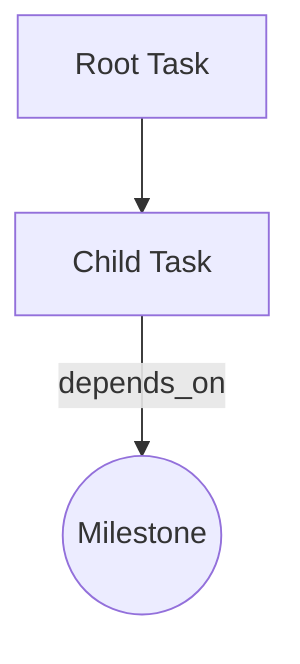

# CLAUDE.md

This file provides guidance to Claude Code (claude.ai/code) when working with code in this repository.

## Project Overview

This is a **dynamic task graph visualizer** that renders Mermaid flowcharts as interactive node-based graphs using React Flow. The frontend polls a `.mmd` file, parses it, and renders it with incremental layout (preserving existing node positions to minimize visual jitter).

**Tech stack:**
- **Frontend**: Vite + React 18 + TypeScript + React Flow (@xyflow/react)
- **Layout**: Custom incremental layout algorithm (src/components/GraphCanvas/useGraphData.ts) with optional ELK.js integration
- **Data format**: Mermaid flowchart subset (graph TD/LR syntax)

## Commands

### Development
```bash
npm run dev        # Start dev server on port 5173 (auto-opens browser)
npm run build      # Production build
npm run preview    # Preview production build on port 5174
```

### Generate dynamic Mermaid data (for testing)
```bash
node scripts/gen-tree-progressive.js  # Progressive tree generation (phases every 5s)
```

## Architecture

### Data Flow
1. **Polling**: `useGraphData` hook fetches `/data/graph.mmd` every 1s
2. **Parsing**: `mermaidAdapter.ts` converts Mermaid syntax to internal `GraphData` format
3. **Layout**: Custom incremental layout in `useGraphData.ts:stableLayout()` - **critical**: preserves previous node positions and only appends new nodes at the tail to avoid visual jitter
4. **Rendering**: React Flow renders nodes using custom `NodeCard` component

### Key Files

- **src/components/GraphCanvas/useGraphData.ts** (lines 20-318): Core data fetching and layout logic.
  - Polls `/data/graph.mmd` every 1s (POLL_MS constant)
  - Uses `stableLayout()` function (lines 20-181) to ensure:
    - Existing nodes **never move**
    - New nodes are appended at the "tail" of their parent's children
    - Two layout strategies: main-chain edges (no label) vs. dependency edges (with label like "depends_on")
  - Toggle between custom layout and ELK.js via USE_ELK_LAYOUT flag (line 8)

- **src/lib/adapters/mermaidAdapter.ts**: Parses Mermaid syntax:
  - `graph TD` or `graph LR` for direction
  - Node syntax: `id[Title]` (rect) or `id((Title))` (circle)
  - Edge syntax: `A --> B` or `A -- label --> B`
  - Auto-creates nodes referenced in edges but not explicitly defined

- **src/lib/layout/elk.ts**: Optional ELK.js integration (currently unused by useGraphData, which uses custom layout)

- **src/components/NodeCard.tsx**: Custom React Flow node component with handles and badge display

### Path Alias
- `@/*` resolves to `src/*` (configured in tsconfig.json)
- Note: vite.config.ts needs path alias plugin if not using default behavior

### Layout Algorithm Details

The `stableLayout()` function (useGraphData.ts:20-181):
1. Classifies edges: main-chain (no label) vs. dependency edges (labeled)
2. For **first render**: assigns root nodes (no parents) initial positions based on direction
3. For **incremental updates**:
   - Preserves all existing node coordinates
   - New nodes positioned at the "tail" of their parent's existing children
   - Uses configurable sibling offset (SIB_GAP=150px) to prevent overlap
4. Gaps: V_GAP=180px (TD vertical), H_GAP=280px (LR horizontal), SIB_GAP=150px (siblings)

**Important**: When modifying layout logic, always ensure `prevPos` coordinates are **strictly preserved** to avoid node jumping.

## Data Format

The app expects a Mermaid flowchart subset in `public/data/graph.mmd`:


- First line: `graph TD` (top-down) or `graph LR` (left-right)
- Comments: lines starting with `//` or `#`
- Node types: `rect` (default) or `circle` (milestone)
- Edge labels: optional, used for dependency relationships
